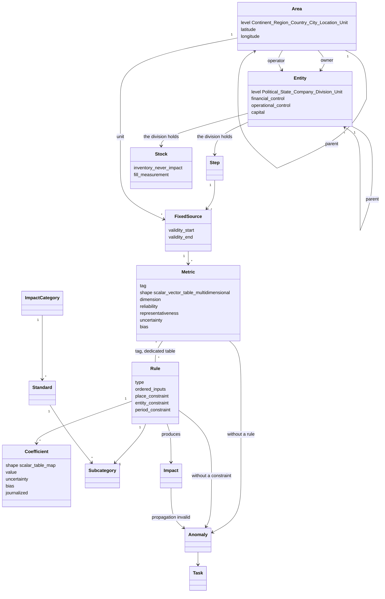

# 03 — The ontology, and what H1 implements of it

*State as of 2 October 2026.*

---

## How to read this note

It comes in **two parts, and the order carries an intent**.

**Part I describes the ontology** — the objects, their relations, and the rules
that bind them. It describes no code. It comes from the maintainer's decisions of
18, 21 and 29 September 2026, carried by issues #47 and #129 to #137, and of
2 October 2026 on uncertainty, carried by #46 and this note's review.

**Part II describes H1** — what the code does today, which is a **collapsed**
ontology: several distinct objects share one column, several relations are
implicit, and a function is stored as a number. Every collapse is named, its
consequence written down, and the issue that lifts it cited.

**When the two contradict each other, both are right, at different dates**: the
code is authoritative for what the platform computes today —
`services/store/schema.sql`, `services/store/app.py`,
`site/assets/js/quality.js` — and the ontology is authoritative for where any
change must head. A discrepancy missing from the table in Part II is a defect of
this note.

**What this note is not.** An ontology also has a formal, machine-readable
representation, and diagrams; the maintainer prefers those to prose. This note
carries a class diagram and notes; the formal form remains to be produced, and it
has no issue yet.

---

# Part I — The ontology

## In one sentence

The chain **acquires metrics**, combines them with **coefficients** inside typed
**rules**, and derives **impacts** filed under **official taxonomies** — every
impact remaining traceable back to the provenance of each of its terms.

## I.1 The vocabulary, and two words that changed

| Term | What it denotes |
|---|---|
| **metric** | an acquired quantity, situated in time, in space and in an organisation |
| **coefficient** | a **function** of nature, time, place and — optionally — entity, from which a value is read |
| **rule** | what combines metrics and coefficients to produce an impact, and files it under a subcategory |
| **impact** | the result, in the CSRD sense: the carbon content of a product, a period's emissions, water withdrawn |
| **fixed source** | the couple **(process step × geographic unit)** — the point where every axis meets |
| **unit** | the leaf of the geographic taxonomy: where it is, and **what measures** |
| **step** | what the material passes through; lives under a division, beside the **stocks** |
| **tag** | what identifies a **series** of metrics, and by which a rule designates it |
| **anomaly** | a state the model declares invalid, and which creates work for a human |

**Two words changed, everywhere** (#131): "factor" becomes **coefficient**,
because a factor does not say it is a function; "variable" becomes **metric**,
because "variable" says nothing at all.

## I.2 The diagram



Two edges carry most of the weight, and they are the two H1 does not have:
**metric — rule** is an **explicit N-to-M relation**, in its own table; and
**rule — subcategory** is the only path by which an impact is filed under a
taxonomy. A metric knows no taxonomy at all.

## I.3 The axes

**The entity** — who owns, who operates, who answers:

```
Political (one or more levels: the EU)
  └─ State ("République française" — the State, not the territory)
       └─ Company (one or more levels)
            └─ Division (one or more levels)
                 └─ Unit (leaf)
```

**The State is a level of its own, and it is not the country.** "République
française" is a State; "France métropolitaine" is a place. They may carry the same
name and are not the same object. **The State sets the applicable regulatory
framework.** And the day enough organisations of one State are tracked, it gives
the frame for a sample: national estimates, under carefully computed weights.

**The `Political` level carries the coefficients that belong to no company.** The
EU defines European companies without being a territory, and, under CBAM,
coefficients applicable to companies established elsewhere. A political entity is
therefore a legitimate holder of a coefficient.

**The area** — where it is, and what measures:

```
Continent → (Region, optional) → Country → City → Location (a SIRET in France) → Unit
```

Every area carries a latitude and a longitude; an area also carries an **owner**
and an **operator**, which are direct edges into the entity taxonomy. Those edges,
together with the flags for financial control, operational control, capital and
own operation, are what **decide the attribution line**: an asset operated and not
held goes to upstream leasing, held and operated by a third party to downstream
leasing, and operational control decides the consolidation perimeter. Without
them, attribution is an assertion rather than a computation.

**The fixed source is the couple (step × unit)**, and that is where the axes meet.
It is not a field: it is a crossing. A "litres of diesel" column with no geographic
unit is not missing an optional field — it designates no fixed source, and there is
nothing for a rule to apply to.

**A unit is a temporal object.** It references a rule and carries a validity
interval: a replaced sensor **terminates** the old unit and **opens** a new one,
which may estimate its impact through a different rule. A unit is never modified in
place — an edit that overwrites the previous one makes every recomputation of the
past wrong without leaving a trace.

**A stock is not a place.** The process stock is abstract, it lives under the
division beside the steps; a warehouse is a building, and may never be used as a
stock. A stock keeps **the inventory, never the impact**, and accumulates by
impact-context classes; a mixing stock follows the **imposed weighted average**. A
stock declares its fill measurement, and that measurement may be held by a third
party, in a different place from the withdrawal, at a cadence unrelated to that of
the flows — fossil water is the limiting case, and a single mine may count them in
the hundreds.

**Time** is the fourth axis, and **the attributes required by the rule** are the
fifth: these are not free-form fields, they are what the rule needs in order to
produce its impact.

## I.4 Metrics

**A cell carries one metric.** But **a metric is not necessarily a scalar**, and
assuming it is makes for a poor design:

| Shape | Example |
|---|---|
| scalar | a volume of fuel |
| homogeneous vector | latitude / longitude; the R, G, B coordinates of a colour |
| variable-length table | a sound |
| multidimensional | an image — the bezel of an analogue instrument |

A homogeneous vector is not a table: its components have distinct ranges and
distinct meanings. Latitude and longitude are both angles, and are not
interchangeable; R, G and B even less so.

**Hence the explicit relation.** If every metric were a scalar, finding the rule
that applies would mean trying every combination of inputs available at a given
time. And sorting inputs by dimension — by the name of the SI unit, in alphabetical
order — fails as soon as a rule has two inputs of the same dimension that do not
form a table. The only satisfactory solution: **tag the series**, and carry an
explicit N-to-M relation between metrics and rules, in a dedicated table. **A
stored metric whose tag is linked to no rule is an anomaly**, to be shown on the
back-office dashboard.

**Units of measure.** A conversion happens **at ingestion**, once, and it depends
on the metric's class (#132): physical goes to **SI**; financial goes to a **mass
of fine gold**, at the price of the ounce, from a daily price table held in the
clients' currencies; social — a headcount — is not converted. Any metric may carry
an uncertainty percentage.

**A leaf of the entity taxonomy carries a single metric per nature at a given
time.** A department that controls several vehicles therefore has two possible
shapes, not three: either the metric is a **`DERIVED` sum** over the vehicles, or
each vehicle is declared as a `Unit`. `DERIVED` then marks the fact that processing
happened **outside the tool**.

## I.5 Rules

**A rule converts metrics and coefficients into an impact, and files it under a
subcategory.** It is not code: it has a **type**, and the type carries the code.
The first type is proportionality, `y = k · x` (#118); identity is another, and a
frequent one.

**The example that shows the identity case.** For subcontracted transport, the
carrier states a value in kgCO2e itself. The rule is identity: use the value as it
stands. The recorded metric **equals** the computed impact. What the standard barely
says is how to qualify that value when it arrives unqualified — and the distinction
is sharp: a value based on a full truckload's actual consumption is a **measured**
metric; a fleet average based on mass and distance, not even accounting for the fill
factor, is an **estimated** one.

**A rule's inputs are canonically ordered** — they are function parameters. The
order does not follow from the dimensions, for the reason given above; it is
declared, and the link to the series runs through the tags.

**A rule's coefficients are scalars or tables.** A table is a coefficient like any
other, and the rule adapts to a range of table sizes: **the number of coefficients
is therefore not constant** for a given type.

**A rule's applicability constraints**: a validity period that must overlap the
emissions', a place, an entity (for a coefficient specific to a company), agreement
between the dimensions of the inputs, and the impact produced, which must be the one
being sought.

**Indexing, in this order.** Classify first by **number of scalar and tabular
inputs** and **number of scalar and tabular coefficients**, then by the dimensions
of the inputs and the impact produced: a search on those criteria is fast in a
database. Constraints come next, because they are more complex — geographic areas —
and so that their expression stays local and simple, they are settled by
**precedence rules: entity-specific rules first**.

**Two anomalies at the rule level**: a rule with **no geographic constraint**, and a
rule with **no validity period**. Both are reported to the Natixar back office.

**The sub-post belongs to the rule, never to the metric.** A rule not attached to a
sub-post is illegal. And the sub-post is not a direct link into a taxonomy: rules
are **universal**, and a rule's sub-post is **the set of information required to
file its impact under the right subcategory of any taxonomy**. A direct consequence:
**a metric linked to no rule is not "unallocated"** — no impact is computable from
it, and that is an anomaly.

**A performance question, to be measured rather than settled in advance.** A plain
`metric × coefficient` rule can multiply into an overwhelming number of rules, and
geographic search may be expensive in PostgreSQL. Hence an option: carry
**geographic maps as first-order parameters** of a rule — maps read at compute time,
mapping a place to a coefficient. Computing interval overlaps is cheaper, but the
same trade-off arises between **temporal maps** and distinct rules. Crossing the
two, a complex rule parameter would be a **geographic map of temporal maps** — a set
of coefficients over a large area and a long period, which is exactly what
electricity is.

## I.6 Coefficients

**A coefficient is a function** of nature (a taxonomy element), time, place, and
optionally entity. Its complete description runs to many records.

**Journalized, not versioned record by record.** An update touches some of the
records and must be coherent: **no pairwise intersection** between its places. To
update a country while keeping a regional particularity, either two successive
updates, or a place "the country except that region". A computation is thus replayed
against the database as it stood at a past date, by **ignoring entries after the
cut-off**.

**Resolution.** Keep only the part that intersects the requested period and place —
including whatever holds for the whole Earth — then walk the updates **from the most
recent to the oldest**. On the entity axis, the query targets the leaf, and **climbs
the tree** if nothing is defined there. Entity-specific values take precedence;
**their cancellation is journalized** through a flag that refers back to the
entity-independent value — a decommissioned solar array.

**Impact is the integral of the rule, not the rule of the integral.** If a
coefficient changes within the period, `flow × duration × coefficient` is wrong. A
30-day step, a flow of 1 kg/s, a coefficient going from 0.5 to 0.8 on the tenth day:
the exact value is **1,814,400** kgCO2e, the end-of-month coefficient alone gives
+14.29 %, the start-of-month one −28.57 %. The single coefficient that reproduces the
exact value is 0.700, which is the **time-weighted mean** — the same imposed weighted
average as for a mixing stock, applied to the time axis. So either the period is cut
at the revisions, or the engine integrates piecewise.

**Ownership and commitment.** Natixar keeps a **reference database** of every
coefficient used by its clients, except those specific to one company — which it
verifies nonetheless — and keeps a **commitment** to those values. The client
software is responsible for **presenting** them when a computation is signed. **Every
coefficient used in a computation enters the signed VC**, together with the rule
references, the metrics, and the elements of the uncertainty computation.

## I.7 Master taxonomies

**There is no client-specific taxonomy.** There are master taxonomies — BEGES, the
GHG Protocol — which aim to apply to any organisation, or to any product when a
Product Environmental Footprint is the goal. A given organisation does not need every
category defined; **that is no reason to define client-specific identifiers**. The
only reason to do so would be to blur the data behind a secret indirection — and the
blur does not hold: grouping cells by category index is enough to recover, without
much difficulty, the main emission categories of a line of business.

**The hierarchy has a shape, and it is imposed:**

```
Impact category   GHG, water use, SVHC, governance, …
  └─ Standard     BEGES v4, BEGES v5, GHG Protocol, ISO …, CBAM-compliant
       └─ …       the grouping logic proper to that standard
            └─ Subcategory   "Combustion in mobile sources"
```

The first level is the **impact category**; it is added when a client wants to, and
is able to, track it. The second is the **standard**, because there is often more
than one way to account for the same impact. Below that, each taxonomy has its own
grouping logic, down to the subcategories.

**Master tables are memorised forever** — official data, current **and obsolete** —
because past publications must remain recomputable. **Their designation is the
standard's own, version included**: the fact that the data is downloaded from our
servers does not stand in the way of independent verification from another source.

**What the front end receives.** The client software receives **only what it needs**:
one worker needs the GHG Protocol categories of his company, an accountant the BEGES
categories of several companies. It keeps in local storage the taxonomy elements and
rules it has met; when a new cell references an unknown rule, which references an
unknown taxonomy element, it **requests them from the server and stores them**. **The
head lines of every taxonomy are always sent and displayed** — the scopes in BEGES,
for instance — so that an organisation **with no** scope 3 emissions is
distinguishable from one that **has not assessed** them.

**A downloadable JSON therefore does not fit** data that grows indefinitely and
changes often: an incremental load mechanism will be needed in any case. What sits in
a table and what is downloadable is secondary; what matters is the official
designation and the incremental load.

**A commercial lead, recorded here so it is not lost again**: this public data could
be offered as *freemium* — a throttled, machine-readable service for everyone, a paid
one for high-volume users. It needs a process that keeps it up to date, but it looks
like a viable business on relatively cheap servers.

## I.8 Quality: facts about every term, labels by projection

**The platform stores facts about each term of a rule, never a quality label.** A
label — `MEASURED`, *donnée primaire*, *Very good* — is what one standard says about a
set of facts, and two standards say different things about the same facts. BEGES calls
a gas-flow measurement multiplied by its GWP *mesurage* (Tableau 3); the GHG Protocol
calls it *direct measurement*; under the rule of this note it is an exact operation on
a measured term. Store the facts, and every label is a projection that can be
recomputed when a standard changes edition. Store a label, and the next standard forces
a reload.

**`origin` says where THE VALUE comes from. `coverage` says whether the SERIES has a
date nobody supplied.** A cell can be measured and fill a calendar hole at the same
time: one axis could not say both. What follows gives `origin` its two facts, adds the
two the standards require beside it, and shows the four values of H1 as one projection
among three.

### The four facts

**1. Reliability — how the number was obtained.** The scale is that of the GHG
Protocol Scope 3 Standard, Box 7.2 (after Weidema & Wesnaes, 1996): *verified data
based on measurements*; *data partly based on assumptions, or non-verified data based
on measurements*; *a qualified estimate* — a sector expert, a nameplate rating, a
supplier's unqualified kgCO2e; *a non-qualified estimate*. The ontology adds the two
ends the standards leave implicit: **computed** — from other terms, by a rule whose
operation and coefficients are exact, inside or outside the tool — and **absent**.

**2. Representativeness — whether the number describes this activity.** BEGES Tableau 4
has four rows, and they are not four grades of one thing. *Primaire* (observed on the
organisation's own information systems and physical readings) and *secondaire* (a
published generic or average value) say **where the number was taken**. *Extrapolée*
(*primary or secondary* data of a **similar** activity, **adapted** to this one) and
*approchée* (the same, **used as is**) say that it was **not taken here**. The Scope 3
Standard says the same with three indicators — technology, time, geography — each
scored by distance from the activity (Table 7.6), and its glossary defines
*extrapolated* and *proxy data* word for word as BEGES does. The ontology keeps the two
questions apart: **source** ∈ {own systems, published generic} and **distance** ∈
{this activity; similar activity, adapted; similar activity, as is}, the three Scope 3
axes being the sub-fields of the distance. December 2024 copied from December 2025 is
*own systems, similar in time, as is*.

**Origin is these two facts together** — reliability and representativeness — and
nothing else. The H1 column of that name is their projection (below).

**3. Statistical uncertainty — a half-width and the probability it covers.** Both
standards use the same object: a relative interval around the point value, at a stated
confidence level. The GHG guidance on uncertainty (§6.2) and the IPCC Good Practice
Guidance it follows use **95 %, two-tailed**, and ask that the level used *always be
reported*; BEGES §5.4 makes no convention of its own and refers to the IPCC guidance,
its glossary defining *incertitude* as the GUM does. The record is therefore
`(half-width %, confidence level, n)`: `n`, because a half-width computed from a sample
carries a t-factor that depends on it (guidance, Annex); the confidence level, because
a source that states none — a factor given as "± 30 %" with no probability — is
recorded as `unstated`, which is a reliability finding and not a number to be silently
read as 95 %. Converting between confidence levels is an exact operation on `k`; it
changes nothing else. *The reference Bilan Carbone worksheets carry a percentage per
factor and per rule; that percentage enters this record, with its stated or unstated
level.*

**4. Bias — the part no interval covers.** GHG Protocol chapter 7 separates
*statistical* parameter uncertainty, which repeated measurement reveals, from
*systematic* uncertainty, which it does not: a factor built from a non-representative
sample, a source not identified, an incomplete method, a faulty instrument. It asks
that biases be **identified, their direction and likely magnitude discussed, and never
propagated** — "because the true value is unknown, such systematic biases cannot be
detected through repeated experiments". BEGES does not model them. The record is
qualitative — `(cause, direction ∈ {over, under, unknown}, magnitude if estimable,
remedy)` — and carries one flag the standards do not name but the maintainer's case
requires: **`method-bound`**, true when no investment in the current method reduces it.
The impact of a cooling unit computed from the power printed on its plate is the
example: the only remedies are to track the leaks, or to change the equipment.

**That case answers question 3 of the previous version of this note, and not the way it
was asked.** The GHG uncertainty guidance (Table 3) rates electricity "*not metered and
… estimated from equipment and time of use*" as *Fair or Poor* — an **estimate**, of
reliability *qualified estimate* under Box 7.2 — not as a non-measurement.
`NOT_MEASURED` therefore keeps its narrow meaning, *the number is absent*, and the
nameplate case is an estimate carrying a method-bound bias. The source is named; the
earlier reading is withdrawn.

### Correlation is read off the graph, not declared

The guidance makes independence a **condition** of its method (§3) and names linear
addition as what replaces quadrature when it fails (§7, note 10). **Which terms share an
error is a fact of the model**: two cells that reference the **same coefficient
object** share its error; two series measured by the **same unit** (I.3: a unit is what
measures, and a replaced sensor opens a new one) share its calibration; two terms
computed by the **same rule** share its model error. Terms that share no object are
independent by default, and a declared `correlation group` covers what the graph does
not — two instruments calibrated by the same laboratory.

### Propagation: on the expression, never on the results

**The uncertainty of a sum of rule applications is computed on the expression, shared
terms factored out — never by combining per-cell uncertainties.** For `y = k · x` with
independent relative uncertainties, `u_y² = u_k² + u_x²` (guidance §7). For a total
`Y = k · Σ xᵢ` over cells that share one coefficient, the coefficient's error enters
once and in full, the metrics' errors in quadrature:

```
U_Y² = (k · Σxᵢ · u_k)²  +  k² · Σ (xᵢ · u_xᵢ)²
```

*Two hundred cells, each xᵢ = 1 at u_x = 0.5 %; one factor k = 1 at u_k = 100 %.
Y = 200. On the expression: coefficient term 200 × 1.00 = 200; metric term
√(200 × 0.005²) = 0.071; U_Y ≈ 200, that is 100 %. Combining per-cell results in
quadrature instead: each cell ≈ √(0.005² + 1²) ≈ 1.00, √200 × 1.00 ≈ 14.1, that is
7 %. The second figure is the one a spreadsheet produces, and it is wrong by a factor
of fourteen.* This is the arithmetic behind the rule recorded on #46 on 31 July —
quadrature for sources whose independence is established, linear for correlated ones —
and the same principle as I.6: the integral of the rule, not the rule of the integral.

**The method has conditions, and the platform checks them rather than assuming them**
(guidance §3 and note 9): errors normally distributed; estimator unbiased; terms
independent, or grouped as above; every individual uncertainty **below 60 %**; no term
raised to a power. A computation that breaches one is not refused: its interval is
marked **`propagation invalid`**, which is an anomaly (below) and hence a task. The
remedy the guidance names — Monte Carlo, the IPCC's Tier 2 — is a second **propagation
rule type**, to be written the day a client's data needs it; until then the breach is
visible rather than hidden under a number.

**Scientific and model uncertainty are out of scope by both standards' own statement**
— the GWP values, the equation itself — and are not numbers in this model. They are
**references**: the standard edition that fixes the GWPs (I.7), the rule type that
fixes the equation (I.5). Both enter the signed VC, so that a verifier knows which
convention was applied; neither widens an interval. Within a standard a GWP is exact by
convention, which is why a gas measurement × GWP is *computed* from a measured term —
*mesurage* in BEGES's words, *direct measurement* in the GHG Protocol's — and why
contrails, whose forcing is a scientific question, are a matter of which standard and
which rule type, not of which interval.

### What an aggregate carries

**An aggregate declares the distribution of its terms' facts, weighted by impact — not
the weakest of them.** Provenance and accuracy are two questions: *can I trace this
value back* on one side, *how wrong is it* on the other. The first propagates as a set,
the useful information being **which share** is estimated and not that some share is;
the second propagates numerically, as above. **The weight is the impact, never the
count.** BEGES asks for primary data *in the emissions*: a site where high-frequency
sensors supply 90 % of the records and 50 % of the emissions, and published averages
the other 10 % of records and 50 % of emissions, has an inventory that is half primary
— the 90/10 split says nothing. Every share the data quality view reports is therefore
in kgCO2e, and the record count a secondary statistic.

**KPI 1 is a statement about terms, not about impacts.** Nearly every impact carries an
emission coefficient with a non-zero uncertainty, so nearly every impact projects to
`ESTIMATED`, and a ratio computed on impact labels would read zero. The 85–90 %
consistency of Annex 2 is measured on the **metrics**: the impact-weighted share of
terms whose reliability is *measured* or *computed* and whose distance is *this
activity*; the remainder is the estimated share, reported beside it. Both numbers are
published; hiding either is what makes the ratio meaningless.

**An estimated detail under a measured aggregate** — one meter covering several
machines, split by running hours — turns origin into a **relation**: this set of
computed values sums to that measured total. It is that internal consistency check
which makes the split defensible, and it is stored as a constraint, not as labels.

**Ordinal grades are display, and belong to the standard.** The guidance's *High /
Good / Fair / Poor* at ± 5 / 15 / 30 % (Table 2) and BEGES's *++++ / ++ / + / –*
(Tableau 4) are read off the stored facts and intervals under the thresholds the
standard's record carries (I.7); none is stored. The guidance says why in as many words
(§9): the transformation into a ranking loses the number it came from.

### Trends

GHG Protocol chapter 7 observes that when a facility keeps the same method, the
systematic terms of two years' estimates are the same and cancel in the difference, so
that the uncertainty of a trend is smaller than that of a total. **The model can say
when that holds**, because a computation's VC references its rule types, coefficient
editions and units: two computations whose shared sources reference the same objects
have the same systematic terms, and their trend carries the statistical terms only.
Where an object changed in between, the cancellation is lost on that source and the
comparison says so — with the caveat the chapter adds itself (note 7): a bias that
drifts does not cancel.

### Labels, by projection

| Facts | This note (H1 `origin`) | GHG Protocol | BEGES |
|---|---|---|---|
| reliability *measured*, distance *this activity*; rule × GWP | `DERIVED` | direct measurement | *mesurage* (Tableau 3) |
| *measured*, *this activity*; rule × emission factor with `u_k > 0` | `ESTIMATED` | indirect measurement, primary data | *calcul* on *données primaires* (Tableaux 3, 4) |
| *computed* from measured terms, exact operation and coefficients — a monthly total ÷ its duration, a sum over vehicles | `DERIVED` | primary data | *données primaires* |
| *measured* or *computed*, source *own systems*, distance *similar, adapted* | `ESTIMATED` | extrapolated data | *données extrapolées* |
| the same, distance *similar, as is* — December 2024 copied from December 2025 | `ESTIMATED` | proxy data | *données approchées* |
| source *published generic*, any distance | `ESTIMATED` | secondary data | *données secondaires* |
| reliability *qualified estimate* — a nameplate, a supplier's unqualified kgCO2e | `ESTIMATED` | estimate, Fair / Poor (guidance, Table 3) | — |
| *absent* | `NOT_MEASURED` | — | — |
| *absent*, and a rule input still unfilled | no cell: an anomaly, and no claim | — | to be *estimée à partir de données secondaires, extrapolées ou approchées* (post 1.2, mobile combustion sources) |

**The four values of `origin` survive as this note's projection.** `MEASURED` is
*measured* and *this activity*; `DERIVED` is *computed* with exact terms from such;
`ESTIMATED` is whatever carries an uncertain coefficient or a distance; `NOT_MEASURED`
is *absent*. The rule of the previous version — **`DERIVED` demands exactness, not
merely explicitness**; the number of seconds in a month is exact, so is an average; a
flow reconstructed from a monthly total is `DERIVED` and does not claim the emission was
a constant stream; as soon as the law itself is uncertain the result is `ESTIMATED` —
is unchanged, and is now a consequence of the facts rather than a definition.

**The surrogate case is settled by Tableau 3.** A measured activity datum multiplied by
an emission factor is *calcul*, not *mesurage*, under BEGES; whether BEGES would call
its result *dérivé* was an open question, and the guide does not use the word. The
projection says `ESTIMATED`, by the coefficient's uncertainty.

**`coverage` is the completeness indicator** of Scope 3 Table 7.6 — the share of the
activity's dates and sites that the data covers — and the one axis on which the schema
and both standards already agree. A cell that fills an absent date is complete on no
axis: its `coverage` says the date was not supplied; its distance says the value came
from elsewhere. The two facts are not redundant: the first counts holes, the second
qualifies the filling. An **unfilled** hole is a different state again — a rule input
absent — and it is the one BEGES means when it says a datum must be estimated before
the balance is drawn: no impact is computable, no claim is signed, and a task exists.

**Anomalies are first-class objects**: a metric with no rule, a rule with no place or
period constraint, a coefficient set that has become invalid over its range, a
propagation whose conditions are breached. Each produces a **task** in the back office,
with a proposed patch; an agent may create the task, **never apply the patch** (#134).
A bias record is not an anomaly: it is a **finding**, and the list of findings sorted by
*impact share × uncertainty* is the investment list the GHG Protocol says an
uncertainty assessment exists to produce.

## I.9 Time, reloads, replay

**A reload ADDS.** Replacement data adds to the old, becomes the default, and **does
not erase what was used for a VC**. An old computation must remain repeatable, **even
a wrong one**, for as long as the fault lies with the client. A cell identifier
derived from the source is therefore not enough: it generalises badly — a first load
giving a yearly aggregate, then a second giving monthly detail, defeat it.

**A generation counter per cell**, initialised to `max(generation) + 1` at the start
of each load, says which load a cell belongs to.

**The identifier may carry a digest** of a reliable serialisation of the time
interval, which makes a cell's identity verifiable without a naming convention.

## I.10 What remains to be settled

| | Question | Where |
|---|---|---|
| 1 | operated / not operated, owned / not owned: a **parameter on leaf entities**, whose representation remains to be discussed | — |
| 2 | geographic and temporal maps as rule parameters, **or** distinct rules: a performance trade-off to be measured | — |
| 3 | ~~`NOT_MEASURED` for a metric that cannot change~~ — **answered** on 2 October: an estimate with a method-bound bias (I.8, guidance Table 3) | — |
| 4 | the **formal, machine-readable** representation of this ontology, and its diagrams | — |
| 5 | where the master tables live, and how a client database declares its edition | #135 |
| 6 | the **incremental** load of taxonomies and rules towards the front end | — |
| 7 | the **Monte Carlo propagation rule type**, for the day a term exceeds 60 % (I.8) | — |
| 8 | a **default uncertainty for a term that states none** — the pedigree approach derives one from the Box 7.2 scores; whether to adopt it, and whose figures | — |
| 9 | the Bilan Carbone worksheets' per-factor percentages: at **which confidence level** they are given, if any | — |

None of these questions has an issue of its own, except the fifth. **A question
without an issue has no owner**: that is a tracking defect, not a property of the
model.

---

# Part II — H1: what the code implements

*The code is authoritative: `services/store/schema.sql`, `services/store/app.py`,
`site/assets/js/quality.js`.*

## II.1 The table of collapses

| The ontology says | H1 does | Consequence | What lifts it |
|---|---|---|---|
| five axes; the fixed source is the couple (step × unit) | `cell.entity_id` carries the entity, the unit **and** the step at once — the two bijections of 2 August: a department *is* a unit, a unit *performs* one operation | confusing a building with a process stock is the **default** behaviour; electricity, which is not metered by department, has no axis that can carry its meter | no issue — the area axis exists in no table |
| master taxonomies, category → standard → subcategory, memorised forever | **one** published, versioned JSON file, with integer identifiers specific to the client | only one standard's line is computable; the identifiers have no official designation; nothing keeps obsolete editions | #131, #135 |
| a typed rule, indexed, constrained, attached to a subcategory | **no rule table**; the cell directly carries `sub_post`, `part_type`, `caracterisation` and a constant coefficient | the sub-post hangs off the metric rather than the rule — the reverse of the ontology; no applicability constraint is checkable | #125, #129 |
| a coefficient is a journalized function | `cell.factor`, a `double precision` **copied into every cell** at load time | a scientific revision forces a reload, and two figures published at two dates become incomparable | #131, #133 |
| a tagged metric of any shape, linked to rules through an N-to-M table | **one scalar** per cell, attached through its own columns | no vector, no table, no image; no metric can be declared orphaned of a rule | no issue |
| a metric with no rule is an **anomaly** | a null `sub_post` means "unallocated", and allocation spreads it | data from which no impact is computable is presented as a remainder to spread | #129 |
| origin is two facts — reliability, representativeness — and the label a projection | `origin = 'MEASURED'`, **hard-coded** by the loader, on every cell; one label column, no fact behind it | the quality view reports 100 % measured, faithfully reporting a false label; a copied month cannot say it is a proxy | #116 |
| every term carries a statistical uncertainty and a bias record; accuracy propagates on the expression | **no** uncertainty column, no bias, no propagation | KPI 1 is a count of labels; no interval exists for any figure the platform signs | no issue |
| quality shares are weighted by impact | the quality view counts **cells**, one each | a client whose few estimated cells carry most of the emissions reads as nearly clean | no issue |
| a reload adds, and never erases what a VC used; one generation per cell | `ON CONFLICT (id) DO UPDATE`, **all columns**: a reload replaces | a yearly aggregate then a monthly detail overwrite each other; no generation counter | no issue |
| anomalies create tasks for a human | **no** table, no route, no screen | a discrepancy that has been observed has no owner inside the tool | #134 |
| a Natixar reference database, client databases fed one way | **one** database, where a client is the subtree hanging from its root | the partition by data owner does not exist; no reference edition is declarable | #135 |
| impact is the integral of the rule | `flow × duration × coefficient`, with a constant coefficient | an intra-month revision is masked without a trace | #133 |
| entities run from `Political` to `Unit`, and the State is a level | two levels: a head organisation and its departments | no regulatory framework is attachable, no national sample | #131 |

**This table is the contract of this note.** Any schema change must add a row to it,
remove one, or explain why it touches none.

## II.2 The three tables

### `entity` — who emits

A two-level tree. The root is the **head organisation** — the client, a legal person
— and its children are its departments.

| Column | Role |
|---|---|
| `id` | integer; it, and it alone, is what credentials see |
| `label` | the name, in the clear — see below |
| `parent` | the parent entity; `NULL` for a head organisation |
| `industrial` | does the material pass through this department, or does the department support it? |
| `legal_name`, `jurisdiction`, `registered_office` | the legal identity — **filled on the head only** |
| `did` | the organisation's decentralised identifier, from which the front end takes the issuer it signs |

**Multi-client separation is the root of the tree, not a column.** Counting per
client reads as "walk the parents up to the root, then group". A `tenant_id` column
on every cell would duplicate what `parent` already knows, and the day the two
diverged, the column is the one that would be believed.

**The shape says which entity is a legal person**: the legal identity columns are
filled on the head only, since departments have none.

**`industrial` decides allocation.** A support department really does emit and belongs
to no lot: its emissions become the **unallocated** bucket, which the allocation rule
spreads across the bars poured that same month. *The ontology names that remainder
differently: a metric with no rule is an anomaly. Here, it is a bucket to spread.*

**Names are in the clear, for now.** They are what reveals the client's
organisational chart, and this is the table that dimension encryption will cover —
decision D1 of issue #6, unsettled. The client, for its part, already knows nothing
but the integers: nothing in the front end will change that day.

### `cell` — the fact table

Nothing but numbers and an interval.

| Column | Role |
|---|---|
| `id` | text, **deterministic**, derived from the source — see "Idempotence" |
| `period` | `tstzrange`, half-open `[start, end)` |
| `entity_id` | the emitting entity — **and**, in H1, the production unit and the process step |
| `sub_post`, `part_type`, `caracterisation` | the position in the taxonomy, as integers; a null `sub_post` means unallocated |
| `flux` | the **flow**, in SI units **per second** |
| `dimension` | what the flow measures — `volume`, `mass`, `energy` |
| `display_unit`, `display_scale` | the unit in which the raw data reads back, and the factor that leads there from SI |
| `factor` | the emission coefficient, in **kgCO2e per SI unit** of activity — a number, not a function |
| `origin` | where the value comes from — the first quality axis |
| `coverage` | does the series have its dates — the second quality axis |

A GiST index covers `period`. Constraints: an interval cannot be empty
(`period_not_empty`); `origin` and `coverage` are restricted to their values.

### `credential` — the credentials received

| Column | Role |
|---|---|
| `digest` | SHA-256 of the canonical form — **the key** |
| `subject` | `credentialSubject.id`, an opaque URN |
| `type` | the meaningful W3C type, excluding `VerifiableCredential` |
| `received_at`, `received_by` | when, and through which account |
| `document` | the credential, **as it stands**, as `jsonb` |

**The key is the document's digest, not the subject.** A bar carries two credentials
— origin, signed by the mine, and carbon intensity, signed by Natixar — and both
carry the same subject, since that is what `derivedFrom` links. Keyed on the subject,
the second to arrive was silently dropped. Keyed on the digest: sending the same file
twice creates nothing, a reissue for the same subject is one more row, and the
register takes the most recent per (subject, type).

**Stored as they stand**, because they are signed: reformatting them would invalidate
them.

## II.3 The flow model

### Why a flow, and not a quantity

A cell carries a mean flow over a period, never a value at an instant. Every query is
therefore an **overlap**: integrating over an arbitrary interval reads as `&&`. Two
separately indexed start/end columns would give a B-tree that degrades on precisely
that query; `tstzrange` and GiST answer it in one pass.

The metric is stored **divided by the duration of its period** — SI units per second
— and the quantity comes back by multiplying by the duration wanted. Integrating over
a window that half-overlaps a monthly cell therefore returns half.

### The model's only assumption

**The flow is assumed uniform over the interval.** Between two monthly readings,
nothing says how consumption was distributed, and a constant flow is the only
distribution that invents no structure.

That assumption has a consequence which governs the API: **the choice of bounds is
free.** Over a shorter window, emissions fall in proportion to time, but so does
production — thirty bars in the month make fifteen in a fortnight. Numerator and
denominator fall together, and intensity per bar does not move. No query bound is
therefore constrained, and nothing is aligned to months.

It degrades gracefully: finer data gives shorter intervals, hence a better
approximation, **without changing model**.

**What that invariance does not cover**: a coefficient that varies within the period.
H1 carries only one, constant; the ontology integrates piecewise (I.6), and that is
where the invariance of the bounds is paid for.

## II.4 Units of measure

**Everything is in SI, and it is the dimension that is stored, not the unit.**
"Volume" reads m³, "mass" kg; divided by the duration, m³/s or kg/s. Naming the unit
on top of the dimension would add a choice where there is none, hence an opportunity
to diverge. *H1 knows physical metrics only: neither the financial one converted to
fine gold nor the unconverted social one of I.4 has any place.*

**The emission coefficient is a number**, always in kgCO2e per SI unit of activity.
The unit follows from `dimension`; carrying "kgCO2e/m³" alongside would be a second
source of truth. Conversion from the source's unit happens **once, at ingestion**.

**`display_scale` avoids writing a unit system.** `display = SI × display_scale`: a
cubic metre is a thousand litres, hence 1000. Knowing that a datum "is in litres" is
useless without a table of symbols, their prefixes and their multiples; the factor
says everything display needs, in one double. It enters no computation.

The computation returns kgCO2e (`RESULT_UNIT`, in `engine.js`).

## II.5 The two quality axes, as stored

`origin` takes its four values from I.8, and `coverage` the two below:

| Value | Meaning |
|---|---|
| `COMPLETE` | the date is covered by the source |
| `MISSING` | the series is periodic, a date is absent, and the cell fills it |

**The cell exists, and it says so.** Loading nothing for an absent month would leave
a hole no count would see: coverage computed over the cells present would read 100 %
while ignoring the missing month. Reconstructing without marking would be worse — the
hole would become invisible while still weighing on published figures. The only
honest choice carries the value and the admission together.

**There is no `INCOMPLETE` value in H1.** Judging that an emission awaits an absent
quantity supposes knowing the **computational intent**, which is not stored. In the
ontology that intent exists: it is the **rule**, with its declared inputs and its
constraints. `INCOMPLETE` becomes derivable there — a rule with a missing input — and
stops being a hard-coded rule.

**Two discrepancies with I.8, not to be forgotten**: `schema.sql` currently carries
the comment *"a `MEASURED` cell can be `MISSING` — the month it is copied from was
indeed measured"*, and the loader writes `MEASURED` as a literal. Both are the subject
of #116. The comment is right about one fact and silent on the other: the copied
month's **reliability** is indeed *measured*, but its **representativeness** is
*similar in time, as is* — BEGES's *donnée approchée* — and it is the second fact that
projects the label to `ESTIMATED`. One column cannot carry two facts, which is the
collapse, not the comment, at fault.

## II.6 Idempotence

Cell identifiers are **deterministic, derived from the source**: a nature prefix, the
month, the department or the product, and the part —
`d/2025-03/<department>/comb`, `x/2025-03/<product>`. Reloading replaces rather than
piling up (`ON CONFLICT (id) DO UPDATE`, all columns included). A load run twice by
mistake would otherwise double the inventory, and that would not show.

**It is an ad hoc method, fitted to the sample data.** It does not generalise: a
yearly aggregate then a monthly detail overwrite one another, and nothing survives
from the previous load. The ontology discards it in favour of addition and the
generation counter (I.9).

## II.7 Who applies the schema

**The store, at start-up** — `lifespan` in `services/store/app.py`, before the first
request. `schema.sql` travels inside the image, beside the queries that depend on it:
a deployed image always finds the database its queries expect.

That is possible without extra privilege because `schema.sql` is **idempotent by
construction** — `CREATE TABLE IF NOT EXISTS`, `ADD COLUMN IF NOT EXISTS` — and
because the migrations sit **after** the `CREATE`s: an `ALTER` on a table the same
file has not yet created would abort the whole transaction. The schema of a migrated
database thus ends up identical to that of a fresh one.

## II.8 The data quality view

*Page `/quality/`, restricted; data served by `GET /api/v1/counts`.*

### Intent

To let Natixar, which operates the platform, **monitor the quality of its clients'
data without reading their business**. The platform's confidentiality claim stands or
falls here: this is the only screen where the operator sees several clients at once.

### Requirements

| | Requirement | Where it comes from |
|---|---|---|
| E1 | **Counts, never a bar.** No bar identifier, no department name. | client confidentiality |
| E2 | **A breakdown per client**, not only a total. | an average does not move when one client in twenty degrades, and one does not intervene with an average |
| E3 | **The two axes kept apart.** Origins share 100 % of a row; coverage is another axis. | adding the five columns would mean nothing |
| E4 | **Zero is not absence.** "0.0 %" and "—" are distinguishable. | a client with no data at all must not pass for spotless |
| E5 | **Client names reserved to the operator.** | teaching a client who else is on the platform is not a feature |
| E6 | **A routing error does not look like an empty platform.** | the site returns 200 for any unknown path |

### Specification

**Access — E5.** Two distinct rights, carried by the account. `counts` opens the view;
`tenants` adds the per-client named breakdown. The operator has both, a client has
neither — the view is about the *platform*, hence about other clients too. **The
refusal comes from the service**, not from the screen: an account without the right
gets `403` even by typing the address, and the page merely says so legibly.

**What `/api/v1/counts` computes — E1, E2.**

- `totals` — the number of cells, entities and credentials;
- `byOrigin` — the number of cells per `origin` value, across the whole platform;
- `byOrganisation`, **only with the `tenants` right** — for each head organisation:
  the number of cells, their spread over the four origins, and the number of
  `MISSING` cells.

A cell's client is **the root of its entity**, obtained by a recursive query that
climbs the tree — in keeping with the rule of `entity`: no `tenant_id` is stored.

**What the page displays — E3, E4, E6.**

- three tiles: cells, entities, credentials;
- a table of origins, in counts and in shares;
- the per-client table, whose header **separates** the four origin columns from the
  coverage column;
- a share reads "—" when the denominator is zero, and "0.0 %" when it is not;
- `NOT_MEASURED` and `MISSING` turn to an alert colour **from 10 %** of the row; the
  other three origins are never coloured;
- before reading the response, the page checks that it is JSON: a home page rendered
  by mistake does not display as a platform without data.

**The unit of account is the cell.** Every share is a ratio of cell counts; a cell
weighs one, whatever emission it carries. *That is a collapse (II.1): the ontology
weighs every share by impact, for the reason given in I.8 — a count can read 90 %
primary where the emissions are 50 %. H1 can compute `flux × duration × factor` per
cell, so the weighting is a change to the query, not to the schema.*

### What the view does not show

No `INCOMPLETE` column, for the reason given in II.5. And no anomaly: a metric with
no rule, a rule with no constraint, an invalid coefficient set do not exist in H1, so
they are displayed nowhere. That is the screen #134 will have to create.
