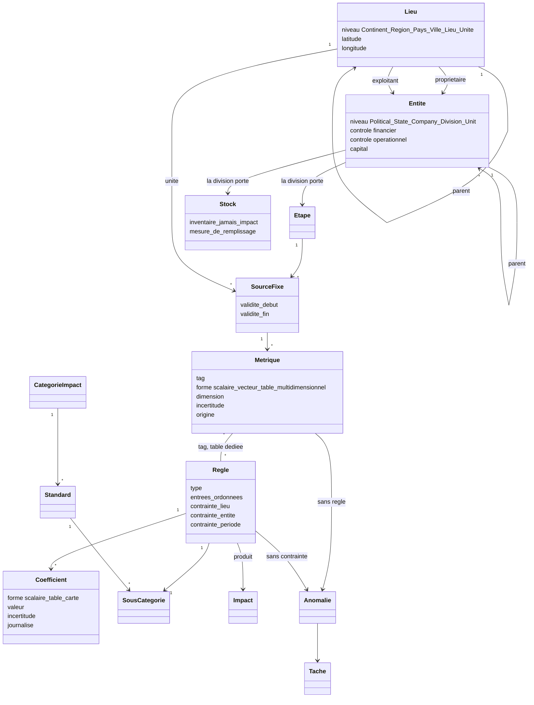

# 03 — L'ontologie, et ce que H1 en implémente

*État au 29 septembre 2026.*

---

## Comment lire cette note

Elle est en **deux parties, et l'ordre porte une intention**.

**La partie I décrit l'ontologie** — les objets, leurs relations, et les règles
qui les lient. Elle ne décrit aucun code. Elle vient des décisions du mainteneur
des 18, 21 et 29 septembre 2026, portées par les issues #47 et #129 à #137.

**La partie II décrit H1** — ce que le code fait aujourd'hui, qui est une
ontologie **effondrée** : plusieurs objets distincts y partagent une colonne,
plusieurs relations y sont implicites, et une fonction y est stockée comme un
nombre. Chaque effondrement est nommé, sa conséquence écrite, et l'issue qui le
lève citée.

**Quand les deux se contredisent, les deux ont raison, à des dates
différentes** : le code fait foi pour ce que la plateforme calcule aujourd'hui —
`services/store/schema.sql`, `services/store/app.py`,
`site/assets/js/quality.js` —, l'ontologie fait foi pour ce vers quoi tout
changement doit aller. Un écart qui n'est pas dans le tableau de la partie II est
un défaut de cette note.

**Ce que cette note n'est pas.** Une ontologie a aussi une représentation
formelle, lisible par machine, et des diagrammes ; le mainteneur les préfère à la
prose. Cette note porte un diagramme de classes et des notes ; la forme formelle
reste à produire, et elle n'a pas encore d'issue.

---

# Partie I — L'ontologie

## En une phrase

La chaîne **acquiert des métriques**, les combine avec des **coefficients** dans
des **règles** typées, et en tire des **impacts** rangés dans des **taxonomies
officielles** — chaque impact restant rattachable à la provenance de chacun de
ses termes.

## I.1 Le vocabulaire, et deux mots qui ont changé

| Terme | Ce qu'il désigne |
|---|---|
| **métrique** | une grandeur acquise, située dans le temps, dans l'espace et dans une organisation |
| **coefficient** | une **fonction** de la nature, du temps, du lieu et — facultativement — de l'entité, dont on lit une valeur |
| **règle** | ce qui combine des métriques et des coefficients pour produire un impact, et le range dans une sous-catégorie |
| **impact** | le résultat, au sens CSRD : contenu carbone d'un produit, émissions d'une période, eau prélevée |
| **source fixe** | le couple **(étape de processus × unité géographique)** — le point où tous les axes se croisent |
| **unité** | la feuille de la taxonomie géographique : où c'est, et **ce qui mesure** |
| **étape** | ce que la matière traverse ; vit sous une division, à côté des **stocks** |
| **tag** | ce qui identifie une **série** de métriques, et par quoi une règle la désigne |
| **anomalie** | un état que le modèle déclare invalide et qui produit du travail pour un humain |

**Deux mots ont changé, partout** (#131) : « facteur » devient **coefficient**,
parce qu'un facteur ne dit pas qu'il s'agit d'une fonction ; « variable » devient
**métrique**, parce que « variable » ne dit rien.

## I.2 Le diagramme

Les noms de classes sont sans accents : c'est une contrainte du rendu, pas une
graphie.



Deux arêtes portent l'essentiel, et ce sont les deux que H1 n'a pas :
**métrique — règle** est une relation **N-à-M explicite**, dans sa propre table ;
et **règle — sous-catégorie** est le seul chemin par lequel un impact se range
dans une taxonomie. Une métrique ne connaît aucune taxonomie.

## I.3 Les axes

**L'entité** — qui possède, qui exploite, qui répond :

```
Political (un ou plusieurs niveaux : l'UE)
  └─ State (« République française » — l'État, pas le territoire)
       └─ Company (un ou plusieurs niveaux)
            └─ Division (un ou plusieurs niveaux)
                 └─ Unit (feuille)
```

**L'État est un niveau à part entière, et il n'est pas le pays.** « République
française » est un État ; « France métropolitaine » est un lieu. Ils peuvent
porter le même nom et ne sont pas le même objet. **L'État fixe le cadre
réglementaire applicable.** Et le jour où assez d'organisations d'un même État
seront suivies, il donnera l'assiette d'un échantillon : des estimations
nationales, sous des poids calculés avec soin.

**Le niveau `Political` porte les coefficients qui ne sont propres à aucune
entreprise.** L'UE définit des sociétés européennes sans être un territoire, et,
au titre du MACF, des coefficients applicables à des entreprises installées
ailleurs. L'entité politique est donc un porteur légitime de coefficient.

**Le lieu** — où c'est, et ce qui mesure :

```
Continent → (Région, facultative) → Pays → Ville → Lieu (un SIRET en France) → Unité
```

Chaque lieu porte latitude et longitude ; un lieu porte aussi un
**propriétaire** et un **exploitant**, qui sont des arêtes directes vers la
taxonomie des entités. Ce sont ces arêtes, avec les drapeaux de contrôle
financier, de contrôle opérationnel, de capital et d'exploitation propre, qui
**décident de la ligne d'attribution** : un actif exploité et non détenu part en
leasing amont, détenu et exploité par autrui en leasing aval, et le contrôle
opérationnel décide du périmètre de consolidation. Sans elles, l'attribution est
une affirmation et non un calcul.

**La source fixe est le couple (étape × unité)**, et c'est là que les axes se
croisent. Ce n'est pas un champ : c'est un croisement. Une colonne « litres de
gazole » sans unité géographique ne manque pas d'un champ facultatif — elle ne
désigne aucune source fixe, et il n'y a rien à quoi appliquer une règle.

**Une unité est un objet temporel.** Elle référence une règle et porte un
intervalle de validité : un capteur remplacé **termine** l'unité ancienne et
**ouvre** une unité nouvelle, qui peut estimer son impact par une autre règle. Une
unité n'est jamais modifiée en place — une modification qui écrase la précédente
rend tout recalcul du passé faux sans laisser de trace.

**Un stock n'est pas un lieu.** Le stock de processus est abstrait, il vit sous la
division, à côté des étapes ; un entrepôt est un bâtiment, et peut n'être jamais
utilisé comme stock. Un stock garde **l'inventaire, jamais l'impact**, et accumule
par catégories de contexte d'impact ; un stock de mélange suit la **moyenne
pondérée imposée**. Un stock déclare sa mesure de remplissage, et cette mesure
peut être portée par un tiers, dans un autre lieu que le prélèvement, à une
cadence sans rapport avec celle des flux — l'eau fossile en est le cas limite, et
une seule mine peut en compter des centaines.

**Le temps** est le quatrième axe, et **les attributs exigés par la règle** sont le
cinquième : ce ne sont pas des champs libres, c'est ce dont la règle a besoin pour
produire son impact.

## I.4 Les métriques

**Une cellule porte une métrique.** Mais **une métrique n'est pas forcément un
scalaire**, et la supposer scalaire est un mauvais choix :

| Forme | Exemple |
|---|---|
| scalaire | un volume de carburant |
| vecteur homogène | latitude / longitude ; les coordonnées R, G, B d'une couleur |
| table de longueur variable | un son |
| multidimensionnel | une image — le cadran d'un instrument analogique |

Un vecteur homogène n'est pas une table : ses composantes ont des domaines et des
significations distincts. La latitude et la longitude sont deux angles, et ne sont
pas interchangeables ; R, G et B le sont encore moins.

**D'où la relation explicite.** Si toutes les métriques étaient des scalaires,
trouver la règle qui s'applique demanderait d'essayer toutes les combinaisons
d'entrées disponibles à un instant donné. Et trier les entrées par dimension —
par le nom de l'unité SI, en ordre alphabétique — échoue dès qu'une règle a deux
entrées de même dimension qui ne forment pas une table. La seule solution
satisfaisante : **taguer les séries**, et porter une relation N-à-M explicite
entre métriques et règles, dans une table dédiée. **Une métrique stockée dont le
tag n'est lié à aucune règle est une anomalie**, à afficher au tableau de bord du
back-office.

**Les unités de mesure.** Une conversion a lieu **à l'ingestion**, une fois, et
elle dépend de la classe de la métrique (#132) : le physique va au **SI** ; le
financier va à une **masse d'or fin**, au cours de l'once, à partir d'une table
des cours tenue quotidiennement dans les monnaies des clients ; le social — un
effectif — ne se convertit pas. Toute métrique peut porter un pourcentage
d'incertitude.

**Une feuille de la taxonomie des entités porte une seule métrique par nature à
un instant donné.** Un département qui contrôle plusieurs véhicules a donc deux
formes possibles, et pas trois : soit la métrique est une **somme `DERIVED`** pour
l'ensemble des véhicules, soit chaque véhicule est déclaré comme une `Unit`.
`DERIVED` marque alors le fait qu'un traitement a eu lieu **hors de l'outil**.

## I.5 Les règles

**Une règle convertit des métriques et des coefficients en un impact, et le range
dans une sous-catégorie.** Elle n'est pas du code : elle a un **type**, et c'est le
type qui porte le code. Le premier type est la proportionnalité, `y = k · x`
(#118) ; l'identité en est un autre, et il est fréquent.

**L'exemple qui montre le cas identité.** Pour un transport sous-traité, le
transporteur énonce lui-même une valeur en kgCO2e. La règle est l'identité :
utiliser la valeur telle quelle. La métrique enregistrée **égale** l'impact
calculé. Ce que le standard ne dit presque pas, c'est comment qualifier cette
valeur quand elle arrive sans qualification — et la distinction est nette : une
valeur fondée sur la consommation réelle d'un camion complet est une métrique
**mesurée** ; une moyenne de parc fondée sur une masse et une distance, sans même
tenir compte du taux de remplissage, est une métrique **estimée**.

**Les entrées d'une règle sont ordonnées canoniquement** — ce sont des paramètres
de fonction. L'ordre ne se déduit pas des dimensions, pour la raison donnée
plus haut ; il est déclaré, et le lien vers les séries passe par les tags.

**Les coefficients d'une règle sont des scalaires ou des tables.** Une table est
un coefficient comme un autre, et la règle s'adapte à une plage de tailles de
table : **le nombre de coefficients n'est donc pas constant** pour un type donné.

**Les contraintes d'applicabilité** d'une règle : une période de validité qui doit
recouvrir celle des émissions, un lieu, une entité (pour un coefficient propre à
une entreprise), la concordance des dimensions des entrées, et l'impact produit,
qui doit être celui qu'on cherche.

**L'indexation, dans cet ordre.** Classer d'abord par **nombre d'entrées scalaires
et tabulaires** et **nombre de coefficients scalaires et tabulaires**, puis par
dimensions des entrées et impact produit : une recherche par ces critères est
rapide en base. Les contraintes viennent ensuite, parce qu'elles sont plus
complexes — des aires géographiques —, et pour que leur expression reste locale et
simple, elles sont départagées par des **règles de précédence : d'abord les règles
propres à une entité**.

**Deux anomalies au niveau de la règle** : une règle **sans contrainte
géographique**, et une règle **sans période de validité**. Toutes deux remontent
au back-office Natixar.

**Le sous-poste appartient à la règle, jamais à la métrique.** Une règle non
rattachée à un sous-poste est illégale. Et le sous-poste n'est pas un lien direct
vers une taxonomie : les règles sont **universelles**, et le sous-poste d'une règle
est **l'ensemble des informations nécessaires pour ranger son impact dans la bonne
sous-catégorie de n'importe quelle taxonomie**. Conséquence directe : **une
métrique qui n'est liée à aucune règle n'est pas « non allouée »** — aucun impact
n'est calculable à partir d'elle, c'est une anomalie.

**Une question de performance, à mesurer et non à trancher d'avance.** Une simple
règle `métrique × coefficient` peut se décliner en un nombre écrasant de règles,
et la recherche géographique peut coûter cher en PostgreSQL. D'où une option :
porter des **cartes géographiques comme paramètres de premier rang** d'une règle —
des cartes lues au moment du calcul, qui associent un lieu à un coefficient. Le
calcul des recouvrements d'intervalles est meilleur marché, mais le même
arbitrage se pose entre **cartes temporelles** et règles distinctes. En croisant
les deux, un paramètre de règle complexe serait une **carte géographique de cartes
temporelles** — un jeu de coefficients sur une grande aire et une longue période,
ce qu'est exactement l'électricité.

## I.6 Les coefficients

**Un coefficient est une fonction** de la nature (un élément de taxonomie), du
temps, du lieu, et facultativement de l'entité. Sa description complète compte
beaucoup d'enregistrements.

**Journalisés, pas versionnés élément par élément.** Une mise à jour touche une
partie des enregistrements et doit être cohérente : **aucune intersection deux à
deux** entre ses lieux. Pour mettre à jour un pays en gardant une particularité
régionale, soit deux mises à jour successives, soit un lieu « le pays sauf cette
région ». On rejoue ainsi un calcul avec la base telle qu'elle était à une date
passée, en **ignorant les écritures postérieures à la coupure**.

**La résolution.** Ne garder que la part qui intersecte la période et le lieu
demandés — y compris ce qui vaut pour la Terre entière —, puis parcourir les mises
à jour **de la plus récente à la plus ancienne**. Sur l'axe des entités, la requête
vise la feuille, et **remonte l'arbre** si rien n'y est défini. Les valeurs propres
à une entité sont prioritaires ; leur **annulation se journalise** par un drapeau
qui renvoie à la valeur indépendante de l'entité — un parc photovoltaïque
décommissionné.

**L'impact est l'intégrale de la règle, pas la règle de l'intégrale.** Si un
coefficient change dans la période, `débit × durée × coefficient` est faux. Un pas
de 30 jours, un débit de 1 kg/s, un coefficient qui passe de 0,5 à 0,8 au dixième
jour : l'exact vaut **1 814 400** kgCO2e, le coefficient de fin de mois seul donne
+14,29 %, celui de début de mois −28,57 %. Le coefficient unique qui redonne
l'exact vaut 0,700, soit la **moyenne pondérée par le temps** — la même moyenne
pondérée imposée que pour un stock de mélange, appliquée à l'axe du temps. La
période se découpe donc aux révisions, ou le moteur intègre par morceaux.

**La propriété et l'engagement.** Natixar tient une **base de référence** de tous
les coefficients utilisés par ses clients, à l'exception de ceux qui sont propres à
une entreprise — qu'elle vérifie néanmoins —, et en conserve un **engagement**. Le
logiciel client a la charge de les **présenter** au moment de faire signer un
calcul. **Tous les coefficients utilisés pour un calcul entrent dans le VC signé**,
avec les références des règles, les métriques, et les éléments du calcul
d'incertitude.

## I.7 Les taxonomies maîtresses

**Il n'y a pas de taxonomie propre à un client.** Il existe des taxonomies
maîtresses — BEGES, GHG Protocol — qui visent à s'appliquer à n'importe quelle
organisation, ou à n'importe quel produit quand le but est une empreinte
environnementale de produit. Une organisation donnée n'a pas besoin de toutes les
catégories définies ; **ce n'est pas une raison pour définir des identifiants
propres au client**. La seule raison de le faire serait de brouiller la donnée par
une indirection secrète — et le brouillage ne tient pas : il suffit de grouper les
cellules par indice de catégorie pour retrouver, sans grande difficulté, les
principales catégories d'émission d'un métier.

**La hiérarchie a une forme, et elle est imposée :**

```
Catégorie d'impact   GES, usage de l'eau, SVHC, gouvernance, …
  └─ Standard        BEGES v4, BEGES v5, GHG Protocol, ISO …, conforme MACF
       └─ …          la logique de groupement propre à ce standard
            └─ Sous-catégorie   « Combustion dans les sources mobiles »
```

Le premier niveau est la **catégorie d'impact** ; elle s'ajoute quand un client
veut et peut la suivre. Le deuxième est le **standard**, parce qu'il y a souvent
plusieurs façons de comptabiliser le même impact. En dessous, chaque taxonomie a
sa propre logique de groupement, jusqu'aux sous-catégories.

**Les tables maîtresses sont mémorisées à jamais** — données officielles,
actuelles **et obsolètes** —, parce qu'il faut pouvoir recalculer une publication
passée. Leur **désignation est celle du standard, version comprise** : le fait que
la donnée soit téléchargée depuis nos serveurs n'empêche pas une vérification
indépendante depuis une autre source.

**Ce que le front reçoit.** Le logiciel client ne reçoit **que ce dont il a
besoin** : un collaborateur a besoin des catégories GHG Protocol de son entreprise,
un comptable des catégories BEGES de plusieurs entreprises. Il garde en stockage
local les éléments de taxonomie et les règles qu'il a rencontrés ; quand une
nouvelle cellule référence une règle inconnue, qui référence un élément de
taxonomie inconnu, il les **demande au serveur et les stocke**. **Les têtes de
toutes les taxonomies sont toujours envoyées et affichées** — les scopes de BEGES,
par exemple — pour qu'on distingue une organisation **sans** émissions de scope 3
d'une organisation qui **ne les a pas évaluées**.

**Un JSON téléchargeable ne convient donc pas** à une donnée qui croît
indéfiniment et change souvent : il faudra de toute façon un chargement
incrémental. Ce qui est en table et ce qui est téléchargeable est secondaire ; ce
qui compte est la désignation officielle et le chargement incrémental.

**Une piste commerciale, enregistrée ici pour ne pas être reperdue** : ces données
publiques pourraient être offertes en *freemium* — service bridé et lisible par
machine pour tous, service payant pour les gros volumes. Il faut un processus qui
les tienne à jour, mais cela ressemble à une activité viable sur des serveurs peu
coûteux.

## I.8 La qualité : d'où vient la valeur, et jusqu'où elle est juste

**`origin` dit d'où vient LA VALEUR. `coverage` dit si la SÉRIE a une date que
personne n'a fournie.** Une cellule peut être mesurée et combler un trou de
calendrier : un seul axe ne pourrait pas le dire.

| Valeur | Sens |
|---|---|
| `MEASURED` | la grandeur a été lue sur un instrument, pour cet intervalle |
| `DERIVED` | elle se déduit d'une grandeur mesurée par une opération **exacte**, dont **tous les coefficients sont exacts** |
| `ESTIMATED` | l'opération ou l'un de ses coefficients est incertain, ou la valeur est empruntée |
| `NOT_MEASURED` | aucune mesure n'existe, et la cellule le déclare |

**`DERIVED` exige l'exactitude, pas seulement l'explicitation.** Le nombre de
secondes d'un mois donné est exact ; une moyenne l'est aussi. Un débit reconstitué
en divisant un total mensuel par la durée du mois est donc `DERIVED` — la grandeur
mesurée est le total, et la répartition à l'intérieur de la période est modélisée.
Mais **dès que la loi elle-même est incertaine** — un coefficient d'émission
approché —, le résultat est `ESTIMATED`, et **l'exactitude se dégrade**. Une valeur
`DERIVED` ne prétend pas que l'émission a été un flux constant.

**L'exactitude se calcule, elle ne se déclare pas.** Les feuilles BEGES de
référence associent une exactitude à des règles précises — coefficients compris —
et la combinent avec les incertitudes portées par les données collectées
elles-mêmes, c'est-à-dire par les métriques.

**`NOT_MEASURED` couvre aussi la métrique qui ne peut pas changer.** Un impact
calculé depuis la puissance nominale inscrite sur la plaque d'un groupe froid n'est
pas une mesure et ne le deviendra jamais : la seule voie d'amélioration est de
changer de méthode — suivre réellement les fuites — ou de changer l'équipement.
**Cette lecture attend une source nommée**, et tant qu'elle n'en a pas, elle ne
vaut pas mieux que l'interprétation qu'elle remplace.

**Un agrégat déclare l'ENSEMBLE de ses origines, pas la plus faible.** Provenance
et exactitude sont deux questions : *puis-je remonter à la source* d'un côté, *de
combien est-ce faux* de l'autre. Un agrégat porte `{MEASURED, ESTIMATED}`, ce qui
conserve l'information utile — **quelle part** est estimée, et non seulement
qu'une part l'est. L'exactitude, elle, se propage numériquement : somme
quadratique pour des sources dont l'indépendance est établie, linéaire pour des
sources corrélées.

**Un détail estimé sous un agrégat mesuré** — un compteur couvrant plusieurs
machines, réparti par temps de marche — fait de l'origine une **relation** : cet
ensemble de valeurs dérivées se somme à ce total mesuré. C'est ce contrôle de
cohérence interne qui rend la répartition défendable.

**Les anomalies sont des objets de plein droit** : une métrique sans règle, une
règle sans contrainte de lieu ou de période, un jeu de coefficients devenu invalide
sur sa plage. Chacune produit une **tâche** dans le back-office, avec un correctif
proposé ; un agent peut créer la tâche, **jamais appliquer le correctif** (#134).

## I.9 Le temps, les rechargements, le rejeu

**Un rechargement AJOUTE.** La donnée de remplacement s'ajoute à l'ancienne,
devient la valeur par défaut, et **n'effface pas ce qui a servi à un VC**. Il faut
pouvoir refaire un calcul ancien, **même faux**, aussi longtemps que la faute est
du côté du client. Un identifiant de cellule dérivé de la source ne suffit donc
pas : il se généralise mal — un premier chargement qui donne un agrégat annuel,
puis un second qui donne le détail mensuel, le mettent en échec.

**Un compteur de génération par cellule**, initialisé à `max(génération) + 1` au
début de chaque chargement, dit à quel chargement une cellule appartient.

**L'identifiant peut porter une empreinte** d'une sérialisation fiable de
l'intervalle de temps, ce qui rend l'identité d'une cellule vérifiable sans
convention de nommage.

## I.10 Ce qui reste à trancher

| | Question | Où |
|---|---|---|
| 1 | exploité / non exploité, détenu / non détenu : un **paramètre des entités feuilles**, dont la représentation reste à discuter | — |
| 2 | cartes géographiques et temporelles comme paramètres de règle, **ou** règles distinctes : arbitrage de performance à mesurer | — |
| 3 | `NOT_MEASURED` pour une métrique qui ne peut pas changer : il manque une **source nommée** | — |
| 4 | la représentation **formelle et lisible par machine** de cette ontologie, et ses diagrammes | — |
| 5 | où vivent les tables maîtresses, et comment une base client déclare son édition | #135 |
| 6 | le chargement **incrémental** des taxonomies et des règles vers le front | — |

Aucune de ces questions n'a d'issue à elle, sauf la cinquième. **Une question sans
issue n'a pas de propriétaire** : c'est un défaut de suivi, pas une propriété du
modèle.

---

# Partie II — H1 : ce que le code implémente

*Le code fait foi : `services/store/schema.sql`, `services/store/app.py`,
`site/assets/js/quality.js`.*

## II.1 Le tableau des effondrements

| L'ontologie dit | H1 fait | Conséquence | Ce qui la lève |
|---|---|---|---|
| cinq axes, la source fixe est le couple (étape × unité) | `cell.entity_id` porte **à la fois** l'entité, l'unité et l'étape — les deux bijections du 2 août : un département *est* une unité, une unité *fait* une opération | confondre un bâtiment et un stock de processus est le comportement **par défaut** ; l'électricité, qui n'est pas comptée par département, n'a aucun axe qui puisse porter son compteur | aucune issue — l'axe « lieu » n'existe dans aucune table |
| des taxonomies maîtresses, catégorie → standard → sous-catégorie, mémorisées à jamais | **un** fichier JSON publié, versionné, à identifiants entiers propres au client | une seule ligne de standard est calculable ; les identifiants n'ont pas de désignation officielle ; rien ne conserve les éditions obsolètes | #131, #135 |
| une règle typée, indexée, contrainte, rattachée à une sous-catégorie | **aucune table de règles** ; la cellule porte directement `sub_post`, `part_type`, `caracterisation` et un coefficient constant | le sous-poste est rattaché à la métrique et non à la règle — l'inverse de l'ontologie ; aucune contrainte d'applicabilité n'est vérifiable | #125, #129 |
| un coefficient est une fonction journalisée | `cell.factor`, un `double precision` **recopié dans chaque cellule** au chargement | une révision scientifique impose un rechargement, et deux chiffres publiés à deux dates deviennent incomparables | #131, #133 |
| une métrique taguée, de forme quelconque, liée aux règles par une table N-à-M | **un scalaire** par cellule, rattaché par ses propres colonnes | ni vecteur, ni table, ni image ; aucune métrique ne peut être déclarée orpheline de règle | aucune issue |
| une métrique sans règle est une **anomalie** | `sub_post` nul signifie « non alloué », et l'allocation le répartit | une donnée dont aucun impact n'est calculable est présentée comme un reste à répartir | #129 |
| l'origine se déduit de la règle et de l'unité qui a produit la valeur | `origin = 'MEASURED'`, **écrit en dur** par le chargeur, sur chaque cellule | la vue qualité annonce 100 % de mesuré et rapporte fidèlement une étiquette fausse | #116 |
| un rechargement ajoute, et n'efface jamais ce qui a servi à un VC ; une génération par cellule | `ON CONFLICT (id) DO UPDATE`, **toutes colonnes** : le rechargement remplace | un agrégat annuel puis un détail mensuel se marchent dessus ; aucun compteur de génération | aucune issue |
| les anomalies produisent des tâches pour un humain | **aucune** table, aucune route, aucun écran | un écart constaté n'a pas de propriétaire dans l'outil | #134 |
| une base de référence Natixar, des bases clients alimentées dans un seul sens | **une** base, où un client est le sous-arbre suspendu à sa racine | la partition par propriétaire de la donnée n'existe pas ; aucune édition de référence n'est déclarable | #135 |
| l'impact est l'intégrale de la règle | `débit × durée × coefficient`, coefficient constant | une révision intramensuelle est masquée sans trace | #133 |
| l'entité va de `Political` à `Unit`, l'État est un niveau | deux niveaux : une organisation de tête, ses départements | aucun cadre réglementaire n'est rattachable, aucun échantillon national | #131 |

**Ce tableau est le contrat de cette note.** Tout changement du schéma doit y
ajouter une ligne, en retirer une, ou expliquer pourquoi il n'en touche aucune.

## II.2 Les trois tables

### `entity` — qui émet

Un arbre à deux niveaux. La racine est l'**organisation de tête** — le client,
personne morale — et ses enfants sont ses départements.

| Colonne | Rôle |
|---|---|
| `id` | entier ; c'est lui, et lui seul, que voient les attestations |
| `label` | le nom, en clair — voir plus bas |
| `parent` | l'entité mère ; `NULL` pour une organisation de tête |
| `industrial` | la matière traverse-t-elle ce département, ou le soutient-il ? |
| `legal_name`, `jurisdiction`, `registered_office` | l'identité légale — **renseignées sur la tête seule** |
| `did` | l'identifiant décentralisé de l'organisation, d'où le front tire l'émetteur qu'il signe |

**Le cloisonnement multi-client est la racine de l'arbre, pas une colonne.**
Compter par client se dit « remonter les parents jusqu'à la racine, puis
grouper ». Une colonne `tenant_id` sur chaque cellule dupliquerait ce que `parent`
sait déjà, et le jour où les deux divergeraient, c'est la colonne qu'on croirait.

**La forme dit laquelle des entités est une personne morale** : les colonnes
d'identité légale ne sont remplies que sur la tête, puisque les départements n'en
ont pas.

**`industrial` décide de l'allocation.** Un département de soutien émet réellement
et n'appartient à aucun lot : ses émissions deviennent le **non alloué**, que la
règle d'allocation répartit entre les barres coulées le mois même. *L'ontologie
nomme ce reste autrement : une métrique sans règle est une anomalie. Ici, c'est un
seau à répartir.*

**Les noms sont en clair, provisoirement.** Ce sont eux qui révèlent
l'organigramme du client, et c'est cette table que le chiffrement des dimensions
couvrira — décision D1 de l'issue #6, non tranchée. Le client, lui, ne connaît
déjà que les entiers : rien du front ne changera ce jour-là.

### `cell` — la table de faits

Rien que des nombres et un intervalle.

| Colonne | Rôle |
|---|---|
| `id` | texte, **déterministe**, dérivé de la source — voir « Idempotence » |
| `period` | `tstzrange`, semi-ouvert `[début, fin)` |
| `entity_id` | l'entité émettrice — **et**, en H1, l'unité de production et l'étape du procédé |
| `sub_post`, `part_type`, `caracterisation` | la position dans la taxonomie, en entiers ; `sub_post` nul = non alloué |
| `flux` | le **débit**, en unité SI **par seconde** |
| `dimension` | ce que le débit mesure — `volume`, `mass`, `energy` |
| `display_unit`, `display_scale` | l'unité où la donnée brute se relit, et le facteur qui y mène depuis le SI |
| `factor` | le coefficient d'émission, en **kgCO2e par unité SI** d'activité — un nombre, pas une fonction |
| `origin` | d'où vient la valeur — premier axe de qualité |
| `coverage` | la série a-t-elle ses dates — second axe de qualité |

Un index GiST porte sur `period`. Contraintes : un intervalle ne peut pas être
vide (`period_not_empty`) ; `origin` et `coverage` sont restreints à leurs valeurs.

### `credential` — les attestations reçues

| Colonne | Rôle |
|---|---|
| `digest` | SHA-256 de la forme canonique — **la clé** |
| `subject` | `credentialSubject.id`, un URN opaque |
| `type` | le type W3C significatif, hors `VerifiableCredential` |
| `received_at`, `received_by` | quand, et par quel compte |
| `document` | l'attestation, **telle quelle**, en `jsonb` |

**La clé est l'empreinte du document, pas le sujet.** Une barre porte deux
attestations — l'origine, signée par la mine, et l'intensité carbone, signée par
Natixar — et toutes deux portent le même sujet, puisque c'est ce que `derivedFrom`
relie. Clé sur le sujet, la seconde arrivée était silencieusement jetée. Clé sur
l'empreinte : renvoyer deux fois le même fichier ne crée rien, une réémission pour
le même sujet est une ligne de plus, et le registre prend la plus récente par
(sujet, type).

**Stockées telles quelles**, parce qu'elles sont signées : les reformater les
invaliderait.

## II.3 Le modèle de flux

### Pourquoi un débit, et non une quantité

Une cellule porte un flux moyen sur une période, jamais une valeur à un instant.
Toutes les interrogations sont donc des **recouvrements** : intégrer sur un
intervalle quelconque se dit `&&`. Deux colonnes début/fin indexées séparément
donneraient un B-tree qui se dégrade précisément sur cette requête-là ;
`tstzrange` et GiST y répondent en une passe.

La métrique est stockée **divisée par la durée de sa période** — unité SI par
seconde — et la quantité se retrouve en multipliant par la durée voulue. Intégrer
sur une fenêtre qui recouvre à moitié une cellule mensuelle rend donc la moitié.

### La seule hypothèse du modèle

**Le débit est supposé uniforme sur l'intervalle.** Entre deux relevés mensuels,
rien ne dit comment la consommation s'est répartie, et un débit constant est la
seule répartition qui n'invente pas de structure.

Cette hypothèse a une conséquence qui gouverne l'API : **le choix des bornes est
libre.** Sur une fenêtre plus courte, les émissions diminuent au prorata du temps,
mais la production aussi — trente barres dans le mois en font quinze en quinze
jours. Numérateur et dénominateur diminuent ensemble, et l'intensité par barre ne
bouge pas. Aucune borne de requête n'est donc contrainte, et rien n'est aligné sur
des mois.

Elle dégrade proprement : des données plus fines donnent des intervalles plus
courts, donc une meilleure approximation, **sans changer de modèle**.

**Ce que cette invariance ne couvre pas** : un coefficient qui varie dans la
période. H1 n'en porte qu'un, constant ; l'ontologie intègre par morceaux (I.6), et
c'est là que l'invariance des bornes se paie.

### Le fuseau

Les bornes sont des minuits **locaux** — le pays d'exploitation est à UTC−4 toute
l'année —, stockés en UTC. Découper sur des minuits Zulu décalerait chaque
frontière de quatre heures, et rangerait une nuit de production dans le mois
suivant.

## II.4 Les unités de mesure

**Tout est en SI, et c'est la dimension qui est stockée, pas l'unité.** « Volume »
se lit m³, « mass » kg ; divisé par la durée, m³/s ou kg/s. Nommer l'unité
par-dessus la dimension ajouterait un choix là où il n'y en a pas, donc une
occasion de divergence. *H1 ne connaît que des métriques physiques : ni le
financier converti en or fin, ni le social non converti de I.4 n'ont de place.*

**Le coefficient d'émission est un nombre**, toujours en kgCO2e par unité SI
d'activité. L'unité se déduit de `dimension` ; porter « kgCO2e/m³ » à côté serait
une seconde source de vérité. La conversion depuis l'unité de la source a lieu
**une fois, à l'ingestion**.

**`display_scale` évite d'écrire un système d'unités.** `affichage = SI ×
display_scale` : un mètre cube vaut mille litres, donc 1000. Savoir qu'une donnée
« est en litres » ne sert à rien sans une table des symboles, de leurs préfixes et
de leurs multiples ; le facteur dit tout ce dont l'affichage a besoin, en un
double. Il n'entre dans aucun calcul.

Le calcul rend des kgCO2e (`RESULT_UNIT`, dans `engine.js`).

## II.5 Les deux axes de qualité, tels qu'ils sont stockés

`origin` prend ses quatre valeurs de I.8, et `coverage` les deux suivantes :

| Valeur | Sens |
|---|---|
| `COMPLETE` | la date est couverte par la source |
| `MISSING` | la série est périodique, une date manque, et la cellule la comble |

**La cellule existe, et elle le dit.** Ne rien charger pour un mois absent
laisserait un trou qu'aucun dénombrement ne verrait : une couverture calculée sur
les cellules présentes vaudrait 100 % en ignorant le mois manquant. Reconstituer
sans marquer serait pire — le trou deviendrait invisible tout en pesant sur les
chiffres publiés. Le seul choix honnête porte la valeur et l'aveu ensemble.

**Il n'y a pas de valeur `INCOMPLETE` en H1.** Juger qu'une émission attend une
grandeur absente suppose de connaître l'**intention de calcul**, qui n'est pas
stockée. Dans l'ontologie, cette intention existe : c'est la **règle**, avec ses
entrées déclarées et ses contraintes. `INCOMPLETE` y devient déductible — une
règle dont une entrée manque —, et cesse d'être une règle codée en dur.

**Deux écarts avec I.8, à ne pas oublier** : `schema.sql` porte aujourd'hui le
commentaire *« une cellule `MEASURED` peut être `MISSING` — le mois d'où on la
recopie était bien mesuré »*, alors que I.8 classe une grandeur empruntée en
`ESTIMATED` ; et le chargeur écrit `MEASURED` en dur. Les deux sont l'objet de
#116.

## II.6 Idempotence

Les identifiants de cellule sont **déterministes, dérivés de la source** : un
préfixe de nature, le mois, le département ou le produit, et la part —
`d/2025-03/<département>/comb`, `x/2025-03/<produit>`. Recharger remplace au lieu
d'empiler (`ON CONFLICT (id) DO UPDATE`, toutes colonnes comprises). Un chargement
joué deux fois par mégarde doublerait sinon l'inventaire, et cela ne se verrait
pas.

**C'est une méthode ad hoc, ajustée au jeu d'essai.** Elle ne se généralise pas :
un agrégat annuel puis un détail mensuel s'écrasent l'un l'autre, et rien ne
survit du chargement précédent. L'ontologie l'écarte au profit de l'ajout et du
compteur de génération (I.9).

## II.7 Qui applique le schéma

**Le magasin, à son démarrage** — `lifespan` dans `services/store/app.py`, avant
la première requête. `schema.sql` voyage dans l'image, à côté des requêtes qui en
dépendent : une image déployée trouve toujours la base que ses requêtes attendent.

C'est possible sans privilège supplémentaire parce que `schema.sql` est
**idempotent par construction** — `CREATE TABLE IF NOT EXISTS`, `ADD COLUMN IF NOT
EXISTS` —, et que les migrations y figurent **après** les `CREATE` : un `ALTER` sur
une table que le même fichier n'a pas encore créée ferait avorter toute la
transaction. Le schéma d'une base migrée finit ainsi identique à celui d'une base
neuve.

## II.8 La vue qualité des données

*Page `/quality/`, réservée ; données servies par `GET /api/v1/counts`.*

### Intention

Permettre à Natixar, qui exploite la plateforme, de **surveiller la qualité des
données de ses clients sans lire leurs affaires**. L'énoncé de confidentialité de
la plateforme se tient ou tombe ici : c'est le seul écran où l'exploitant voit
plusieurs clients à la fois.

### Exigences

| | Exigence | D'où elle vient |
|---|---|---|
| E1 | **Des dénombrements, jamais un lingot.** Aucun identifiant de barre, aucun nom de département. | la confidentialité client |
| E2 | **Une répartition par client**, et pas seulement un total. | une moyenne ne bouge pas quand un client sur vingt se dégrade, et l'on n'intervient pas auprès d'une moyenne |
| E3 | **Les deux axes séparés.** Les origines se partagent 100 % d'une ligne ; la couverture est un autre axe. | additionner les cinq colonnes n'aurait aucun sens |
| E4 | **Zéro n'est pas absence.** « 0,0 % » et « — » se distinguent. | un client sans aucune donnée ne doit pas passer pour irréprochable |
| E5 | **Les noms de clients réservés à l'exploitant.** | apprendre à un client qui d'autre est sur la plateforme n'est pas une fonctionnalité |
| E6 | **Une erreur de routage ne ressemble pas à une plateforme vide.** | le site rend 200 pour tout chemin inconnu |

### Spécification

**Accès — E5.** Deux droits distincts, portés par le compte. `counts` ouvre la
vue ; `tenants` y ajoute la répartition nominative par client. L'exploitant a les
deux, un client n'a ni l'un ni l'autre — la vue porte sur la *plateforme*, donc sur
les autres clients aussi. **Le refus vient du service**, pas de l'écran : un compte
sans droit reçoit `403` même en tapant l'adresse, et la page se contente de le dire
lisiblement.

**Ce que calcule `/api/v1/counts` — E1, E2.**

- `totals` — le nombre de cellules, d'entités et d'attestations ;
- `byOrigin` — le nombre de cellules par valeur d'`origin`, sur toute la
  plateforme ;
- `byOrganisation`, **seulement avec le droit `tenants`** — pour chaque
  organisation de tête : le nombre de cellules, leur répartition sur les quatre
  origines, et le nombre de cellules `MISSING`.

Le client d'une cellule est **la racine de son entité**, obtenue par une requête
récursive qui remonte l'arbre — conformément à la règle de `entity` : aucun
`tenant_id` n'est stocké.

**Ce qu'affiche la page — E3, E4, E6.**

- trois vignettes : cellules, entités, attestations ;
- un tableau des origines, en nombre et en part ;
- le tableau par client, dont l'en-tête **sépare** les quatre colonnes d'origine de
  la colonne de couverture ;
- une part vaut « — » quand le dénominateur est nul, et « 0,0 % » quand il ne l'est
  pas ;
- `NOT_MEASURED` et `MISSING` passent en couleur d'alerte **à partir de 10 %** de
  la ligne ; les trois autres origines ne sont jamais colorées ;
- avant de lire la réponse, la page vérifie qu'elle est du JSON : une page
  d'accueil rendue par erreur ne s'affiche pas comme une plateforme sans données.

**L'unité de compte est la cellule.** Chaque part est un rapport de nombres de
cellules ; une cellule y pèse un, quelle que soit l'émission qu'elle porte.

### Ce que la vue ne montre pas

Aucune colonne `INCOMPLETE`, pour la raison donnée en II.5. Et aucune anomalie :
une métrique sans règle, une règle sans contrainte, un jeu de coefficients invalide
n'existent pas en H1, donc ne s'affichent nulle part. C'est l'écran que #134 aura à
créer.
